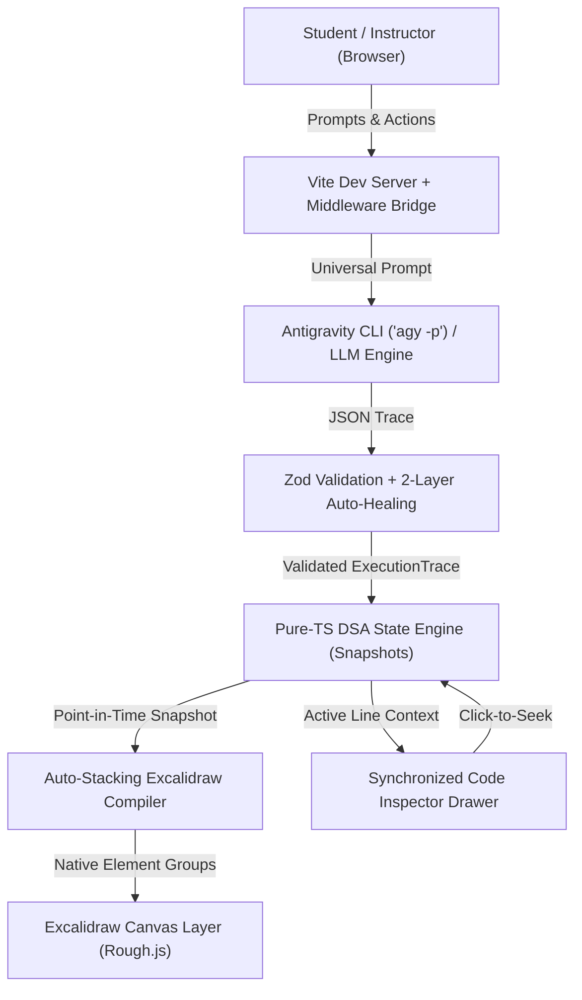
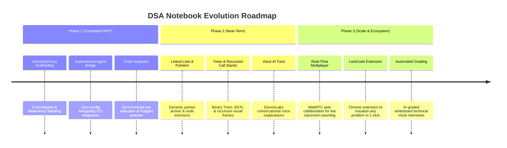

# DSA Notebook — Hackathon Pitching Master Guide

> **Project Name:** **DSA Notebook**  
> **Tagline:** The AI-Powered Interactive Whiteboard Where Algorithms Come Alive  
> **Hackathon Tracks:** Developer Tools • AI & Agentic Interfaces • EdTech / Education  
> **Live Demo URL:** `http://localhost:5173`  
> **Source Repository:** `https://github.com/ThekingGST/DSA-Notebook` (Branch: `feat-hackathon`)

---

## Table of Contents
1. [The 30-Second & 2-Minute Elevator Pitch](#1-the-elevator-pitch)
2. [The Core Problem & Market Opportunity](#2-the-problem--market-opportunity)
3. [The Solution & Unique Value Proposition](#3-the-solution--value-proposition)
4. [Complete Technology Stack](#4-complete-technology-stack)
5. [Key Product Features & Capabilities](#5-key-product-features--capabilities)
6. [Architectural Deep-Dive & Engineering Moat](#6-architectural-deep-dive--engineering-moat)
7. [Step-by-Step Live Demo Runbook](#7-step-by-step-live-demo-runbook)
8. [Judges' Toughest Questions & Winning Answers (Q&A Defense)](#8-judges-q--winning-answers)
9. [Future Roadmap & Enhancements](#9-future-roadmap--enhancements)
10. [Presentation Checklist & Pro Tips](#10-presentation-checklist--pro-tips)

---

## 1. The Elevator Pitch

### The 30-Second Hook (For lightning pitches or opening statements)
> *"When you first learned Binary Search, Dynamic Programming, or Two Pointers, where did your professor explain it? On a whiteboard. When you interview at Google or Meta, where do you explain your reasoning? On a whiteboard.*  
> *Yet today, CS education is trapped between two broken extremes: dumb drawing apps where teachers waste 60% of their lecture drawing boxes by hand, and canned animation websites that can't answer questions or adapt to custom inputs.*  
> *We built **DSA Notebook** — the world's first programmable, stateful whiteboard where an AI Tutor and human teachers can generate, scrub, inspect, and converse with algorithms in real time, with zero manual copy-pasting."*

### The 2-Minute Full Pitch (For standard demo rounds)
> *"Judges, over 50 million students and developers grind Data Structures & Algorithms every single year. Yet 80% struggle with spatial reasoning because algorithms are taught either as abstract text code or passive pre-rendered videos.*  
> *Algorithms are not code; algorithms are state transitions over structured memory.*  
> *With **DSA Notebook**, a student simply types any DSA question in natural language: 'Show me how to merge two sorted arrays [1,3,5] and [2,4,6]'.*  
> *Instantly, our local Antigravity AI Agent classifies the problem into one of 6 Universal Array Archetypes, creates visual memory objects on an infinite Excalidraw canvas, and maps out a deterministic step-by-step execution trace.*  
> *Students don't just watch — they can scrub through point-in-time snapshots, open our synchronized **Code Inspector** to see the exact line of Python, Java, or C++ executing in lock-step, click any line in the code to seek the animation, and toggle into **Teacher Mode** to drag pointers and mutate cells directly on the board.*  
> *It's not a video; it's a living, stateful memory canvas built for human intuition."*

---

## 2. The Problem & Market Opportunity

| Dimension | The Status Quo | Why It Fails | How DSA Notebook Solves It |
| :--- | :--- | :--- | :--- |
| **Passive Visualizers** (VisuAlgo, NeetCode videos) | Pre-baked animations with rigid, hardcoded inputs | Can't handle custom inputs, edge cases, or student questions | Generates dynamic whiteboard representations for **any custom user array or constraint** |
| **Dumb Whiteboards** (Excalidraw, Miro, iPad notes) | Disconnected SVG rectangles, manual text editing | Teachers spend 60% of lecture time erasing and redrawing numbers and arrows | **Stateful DSA Objects**: Arrays know their cells; pointers auto-snap and glide; auxiliary arrays auto-stack |
| **Code Debuggers** (VS Code, LeetCode debug console) | Terminal printouts or watch window text | High cognitive load; lacks spatial and geometric representation of memory | **Synchronized Dual Representation**: Canvas whiteboard state + side-by-side active line highlighting |

### Total Addressable Market (TAM)
- **50M+** CS university students, bootcamp cohorts, and self-taught developers worldwide.
- **$15B+** global STEM / coding education and developer interview prep market.

---

## 3. The Solution & Value Proposition

DSA Notebook introduces three foundational concepts:
1. **The Stateful Whiteboard Layer**: Built on Excalidraw, elements are not dumb drawing shapes. They are typed **DSA Objects** (`Array`, `Pointer`, `Variable`) with semantic identity and coordinate bindings.
2. **Deterministic Pure-Engine Snapshots**: A headless TypeScript runtime that evaluates algorithm state changes as $O(1)$ point-in-time snapshots, enabling instant, glitch-free bidirectional scrubbing.
3. **Single-Pass Synchronized Code Inspector**: Displays production-grade source code with active line highlighting, execution pointers (`▶`), auto-scroll, and on-demand polyglot translation (Python, Java, C++, TypeScript).
4. **Autonomous AI Agent Pipeline**: Fully integrated with the local **Antigravity CLI (`agy`)**, transforming natural language prompts into validated visual traces automatically without API keys or manual pasting.

---

## 4. Complete Technology Stack



### Frontend Architecture
- **Framework & Core**: React 18 with TypeScript 5 (Strict Mode).
- **Styling**: Tailored Vanilla CSS design system (dark-mode zinc/slate palette `#18181b`, smooth glassmorphism, responsive drawers, tokenized syntax highlighting).
- **Whiteboard Engine**: `@excalidraw/excalidraw` (Rough.js sketchy hand-drawn aesthetics, infinite zoom/pan, custom pointer snapping).
- **Build System & Tooling**: Vite 5 with HMR, Vitest test runner (169 tests across 22 suites), ESLint.

### Backend & AI Middleware
- **AI Agent Automation**: Local Antigravity CLI (`agy`) bridge via Node `child_process.execFile` (`/api/antigravity/generate`, `/api/antigravity/translate`, `/api/antigravity/generate-code`).
- **Prompt Engineering**: 6 Universal Array Archetypes System Prompt (Single-Pass Scanner, Two-Pointer Convergence, Sliding Window, Dual-Array Coordination, In-Place Partitioning, 2D Grid Traversal).
- **Validation & Resiliency**: Zod schema validation with a **2-layer deterministic auto-healing runtime** (boundary clamping, string coercion, out-of-bounds pointer prevention).
- **Cloud Fallback**: Direct NVIDIA NIM API integration for remote or cloud deployments.

---

## 5. Key Product Features & Capabilities

### 🎓 1. Student Mode (AI Tutor & Visual Reasoning)
- **Natural Language Input**: Type any DSA question (e.g. *"Show Dutch National Flag sorting on [2, 0, 2, 1, 1, 0]"*).
- **Universal Multi-Array Auto-Stacking**: Automatically calculates collision-free vertical coordinates and labels for multi-array problems (Prefix Sums, Merge Buffers, 2D Grids).
- **Interactive Playback Dock**: Play/Pause, Step Forward, Step Backward, Scrub slider, and keyboard hotkeys (Space for Play/Pause, Arrow keys for step navigation).
- **Narration Banners**: Clear, didactic step titles and explanations written by the AI Tutor for each state change.

### 💻 2. Synchronized Code Inspector (ADR-0010)
- **Collapsible Docked Side-Panel**: 380px slide-out drawer accessible via the top navbar `[💻 Code]` button.
- **Active Line Glow & Gutter Marker**: Active executing line lights up with an indigo glow (`rgba(99, 102, 241, 0.22)`), left border accent, and pointer arrow (`▶`).
- **Smooth Auto-Scroll**: Keeps long functions centered on the active line as steps advance.
- **Click-to-Seek Navigation**: Click any line number in the gutter to seek the animation directly to the step executing that line.
- **Polyglot Switcher**: Instant switching between Python, Java, C++, and TypeScript with on-demand AI translation.
- **Graceful Empty State**: Includes a *"⚡ Generate Code with Antigravity"* one-click action for custom or older traces.

### 👨‍🏫 3. Teacher Mode (Live Classroom Cockpit)
- **Visual Toolbox**: Add Arrays, append/remove cells from both ends with instant `[+]` / `[-]` badges.
- **Interactive Pointer Snapping**: Drag pointers across cells; pointers auto-snap to cell centers with magnetic bounds.
- **In-Place Cell Editing**: Double-click any cell to edit its value directly on the whiteboard canvas.
- **Freeform Markup**: Write notes, circle elements, or draw arrows right on top of live data structures using native Excalidraw drawing tools.

---

## 6. Architectural Deep-Dive & Engineering Moat

### 1. Why 100% Decoupled State Engine?
Many hackathon projects bundle animation code directly into React state or canvas rendering loops. DSA Notebook deliberately separates state from rendering:
- `DSAStateEngine.ts` is a **pure, headless TypeScript class** with no DOM or canvas dependencies.
- It takes an `ExecutionTrace` and precomputes immutable `ComputedSnapshot[]` arrays in $O(N)$ time.
- Moving to step $K$ is an **$O(1)$ lookup**, meaning scrubbing forward and backward has zero latency, zero memory leaks, and 0% chance of visual state desynchronization.

### 2. Multi-Array Auto-Stacking Layout Engine (`arrayLayout.ts`)
Instead of expecting the AI model to guess pixel coordinates:
- The client-side compiler calculates cell sizes, margins, pointer heights, and vertical stacking offsets deterministically.
- Arrays are stacked with a calculated offset (e.g. `arrY + 120px`), rendering prefix sums and merge buffers cleanly separated with left-aligned badge labels (`nums1:`, `nums2:`, `merged:`).

### 3. The 2-Layer AI Auto-Healing Pipeline (`traceSchema.ts`)
LLMs often make subtle off-by-one errors (e.g. pointing to `index: 5` on a 5-element array). Rather than crashing:
- **Layer 1: Deterministic Auto-Healer**: Automatically clamps pointer indices to `[-1, length]`, clamps write/swap indices to `[0, length - 1]`, coerces stringified line numbers, and removes out-of-bounds highlight targets.
- **Layer 2: Strict Zod Validation**: Verifies array identity, pointer target existence, and structural invariants. If validation fails, it triggers automatic self-correction prompts.

---

## 7. Step-by-Step Live Demo Runbook

Follow this exact sequence during your 3-to-5 minute pitch for maximum judge impact:

```
[0:00 - 0:30] Hook & Intro
├── Show the home screen with "🤖 Antigravity Connected" badge visible.
└── Deliver the 30-Second Elevator Pitch.

[0:30 - 1:30] Student Mode & Synchronized Playback
├── Open Header [💻 Code] button -> Drawer smoothly slides out showing Python code.
├── Press Spacebar (Play) -> Watch low, mid, high pointers glide across array [10, 25, 7, 42, 18].
├── Point out: "Look at the Code Inspector — line 7 lights up with the ▶ pointer, perfectly in sync with the comparison on the canvas!"
└── Click Line 5 in the gutter -> Watch canvas immediately jump to that step (Click-to-Seek).

[1:30 - 2:30] Autonomous AI Generation
├── In the bottom PromptBar, type: "Merge sorted arrays [1, 3, 5] and [2, 4, 6]"
├── Hit Enter -> Point out status: "🤖 Antigravity CLI is reasoning & generating algorithm steps..."
├── In ~15 seconds, boom: 3 stacked arrays appear on the whiteboard (nums1, nums2, merged)!
└── Step through: show dedicated pointers (i, j, k) and cells being written in green.

[2:30 - 3:30] Teacher Mode & Live Manipulation
├── Toggle top switch to "👨‍🏫 Teacher Mode".
├── Double click cell [2] -> Change value from 5 to 99.
├── Click [+] on array end -> Add a new cell on the fly.
├── Drag pointer 'i' across to the new cell -> Watch it magnetically snap.
└── Use Excalidraw freehand pen to draw a circle around the pivot and write "O(N) time".

[3:30 - 4:00] Architecture, Tech Stack & Vision
├── Highlight 169 automated Vitest tests, pure TypeScript engine, and zero-config local CLI integration.
└── Conclude with the vision: "Turning whiteboards into the operating system for algorithmic thinking."
```

---

## 8. Judges' Q&A Winning Answers

### Category 1: Technical & Architecture

#### Q1: "Why not just use an existing visualizer like VisuAlgo or generate a GIF/video with Python Manim?"
> **Winning Answer:**  
> *"Pre-rendered animations and videos are fundamentally write-only and inflexible. If a student wants to test an array with negative numbers, duplicate values, or an odd length, VisuAlgo has no answer, and Manim takes 2 minutes to re-render a static MP4.*  
> *DSA Notebook is a **live, stateful memory environment**. Because our State Engine evaluates snapshots deterministically in pure TypeScript, the user can scrub backward, modify cells midway, draw notes directly on top of the elements, and have an AI tutor answer contextual questions about the active state. It’s an interactive whiteboard, not a video player."*

#### Q2: "How do you guarantee the AI won't hallucinate invalid indices or crash the app?"
> **Winning Answer:**  
> *"We implemented a strict **two-layer defensive pipeline**.  
> First, our system prompt strictly constrains generation to 6 Universal Array Archetypes and forbids JavaScript expressions.  
> Second, before the trace reaches the canvas, it passes through our deterministic **auto-healing pipeline** in `traceSchema.ts`. If the LLM produces an off-by-one pointer index (like index 6 on an array of length 6), our runtime clamps it to valid bounds. If a highlight points to a non-existent index, it is sanitized without failing. If an invariant is truly broken, Zod flags it and our multi-turn retry mechanism requests an immediate self-correction. In our test suite, over 160 rigorous invariant tests guarantee that invalid state never reaches the renderer."*

#### Q3: "How does the canvas coordinate system stay aligned when teachers add cells or drag arrays?"
> **Winning Answer:**  
> *"We built a custom auto-stacking compiler (`compileDSAToExcalidraw.ts`) that groups primitives into semantic Excalidraw elements. Pointers are mathematically bound to their parent array ID and cell index:  
> $$x = array.x + index \times cellWidth + \frac{cellWidth}{2}$$  
> When multiple pointers land on the same cell (e.g. `low` and `mid`), our layout engine automatically stacks them vertically with calculated offsets so labels never overlap. In Teacher Mode, when a user drags a pointer, an on-canvas spatial distance algorithm calculates the nearest cell center and magnetically snaps the pointer to it."*

#### Q4: "How does the line-to-step synchronization work between the code and the canvas?"
> **Winning Answer:**  
> *"Our AI prompt uses a single-pass protocol: the model generates the complete canonical function under `trace.code` and assigns a 1-indexed `codeContext.line` to each algorithm step. When the animation advances to step $N$, the Code Inspector matches that line, highlights it with CSS glow, and calls `scrollIntoView()`. Conversely, when a student clicks line 7 in the code gutter, the app scans `trace.steps` for the first step where `codeContext.line === 7` and seeks the playback engine directly to that frame in $O(1)$ time."*

---

### Category 2: Product & Market

#### Q5: "How is this different from LeetCode's built-in debugger or Python Tutor?"
> **Winning Answer:**  
> *"Python Tutor and LeetCode debuggers show low-level stack frames and raw memory addresses in standard text boxes. That is great for debugging syntax, but terrible for developing spatial intuition for how pointers converge, windows slide, or partitions divide memory.*  
> *DSA Notebook uses Rough.js hand-drawn whiteboard aesthetics with color-coded persistent highlights (e.g. verified sorted partitions locking into emerald green). Furthermore, neither LeetCode nor Python Tutor allows a professor to pick up a digital pen, add cells in real time, or draw freehand explanations on top of the live memory heap."*

#### Q6: "Who is your target customer and what is your business model?"
> **Winning Answer:**  
> *"We have a B2C and B2B dual-track:  
> 1. **B2C (Freemium for Students & Job Seekers)**: Free access to standard archetypes and presets. Pro tier ($12/mo) offers unlimited AI reasoning queries, full interview question import, and voice-guided AI Tutor explanations.  
> 2. **B2B (SaaS for Universities, Bootcamps, & EdTechs)**: Classroom licenses for CS professors with interactive presentation mode, student breakout sandboxes, and LMS integrations (Canvas, Blackboard).  
> 3. **Tech Recruiting & Mock Interviews**: An interactive whiteboard sandbox for companies like Karat or HackerRank to conduct live visual technical interviews."*

---

### Category 3: AI & Scalability

#### Q7: "What is your latency and cost per generation?"
> **Winning Answer:**  
> *"Because our system prompt generates the canonical code and the complete execution trace in a **single pass**, we only make one inference call per problem.  
> With our local Antigravity CLI (`agy`), generation runs in ~15 to 20 seconds with **zero API token cost** to the user. When deployed to the cloud via NVIDIA NIM or Anthropic Claude, cost is less than $0.005 per complete trace, and users can cache common algorithms locally."*

#### Q8: "Can this work offline in air-gapped classrooms or low-bandwidth environments?"
> **Winning Answer:**  
> *"Yes! The pure TypeScript State Engine and Excalidraw renderer run 100% locally in the client browser. All built-in algorithm presets (Binary Search, Two Pointers, Linear Scan, Second Largest) work completely offline without any internet connection or LLM access. Teachers can use Teacher Mode anywhere without an internet connection."*

---

## 9. Future Roadmap & Enhancements



### 1. Advanced Data Structure Expansion
- **Linked Lists**: Node chaining, pointer reassignment animations (detecting cycles, reversing lists).
- **Binary Trees & BSTs**: Hierarchical node layout with traversal orders (In-Order, Pre-Order, Post-Order, BFS level-order).
- **Graphs**: Adjacency lists and matrices with Dijkstra / BFS / DFS pathfinding highlights.
- **Dynamic Programming Matrices**: 2D grid value propagation with dependency arrows.

### 2. Voice-Guided Interactive Audio Tutor
- Integrate Web Speech API or ElevenLabs to have the AI Tutor speak the didactic explanations aloud as pointers glide across the board.

### 3. Real-Time Collaborative Multiplayer
- Integrate WebRTC / Liveblocks so professors and students can share a whiteboard session with synchronized cursors and collaborative pointer manipulation.

### 4. Chrome Extension for LeetCode & HackerRank
- A browser extension adding a **"Visualize on DSA Notebook"** button to any LeetCode problem, auto-generating the whiteboard animation instantly.

---

## 10. Presentation Checklist & Pro Tips

### Before Stepping on Stage
- [ ] Dev server running (`npm run dev`) at `http://localhost:5173`.
- [ ] Check top header: verify `🤖 Antigravity Connected` green pill is visible.
- [ ] Test browser zoom at 100% and test pressing **Spacebar** to ensure playback hotkeys work.
- [ ] Have preset "Binary Search" or "Two Pointers" ready as the initial screen.
- [ ] Keep Code Inspector drawer closed initially so you can do the dramatic reveal when clicking **`[💻 Code]`**.

### Delivery Pro Tips
- **Speak in Terms of Spatial Memory**: Say *"memory addresses"*, *"pointers"*, and *"state transitions"*, not just *"drawing shapes"*.
- **Let the Animation Breathe**: When you hit Play, pause speaking for 3 seconds so the judges can watch the pointers glide across the cells and the code lines light up.
- **Emphasize Two-Way Control**: Remind them: *"I can drive the code from the whiteboard, and I can drive the whiteboard from the code."*
- **End with Confidence**: *"DSA Notebook bridges the gap between how our brains visualize algorithms and how computers execute them."*
